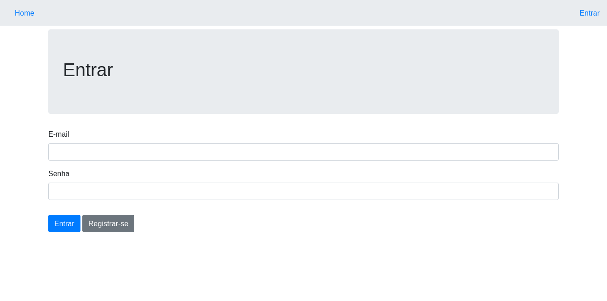

# Controle de Séries

### Aplicação desenvolvida como parte do aprendizado na utilização do Framework PHP Laravel.

O intuito da aplicação foi criar um sistema que possibilitasse ao usuário realizar o cadastro de Séries e suas Temporadas e Episódios, além de controlar quais episódios já foram assistidos.

Todos os registros são armazenados em Banco de Dados com todas as devidas relações entre as tabelas e a inserção, alteração e exclusão de registros somente é permitida para usuários autenticados.

O cadastro de usuários pode ser realizado diretamente na pagina de Login do Sistema.

A aplicação conta com a realização de alguns Testes Automatizados.

## Executar o projeto

 - Após baixar o projeto, instale todas as dependências do projeto com o comando `composer install`;
 - Execute as _migrations_ digitando `php artisan migrate`;
 - Realize os testes automatizados executando o comando `vendor/bin/phpunit`;
 - Para subir a aplicação no servidor local, utilize `php artisan serve`;

## Requisitos
 - [x] PHP 7.2 ou superior
 - [x] SGBD (MySQL, SQLite)
 - [x] Servidor Web (Apache, Nginx)
